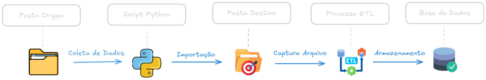

# IMPORTAÇÃO AUTOMÁTICAS DE ARQUIVOS


## Visão Geral

Este projeto consiste em um script python que automatiza a movimentação de arquivos em formato `.xlsb`, transferindo - os diariamente às 06:00 da manhã de uma pasta de origem para uma pasta de destino. Os arquivos na pasta de destino são substituídos pelos novos arquivos movidos. Posteriormente, um processo de ETL captura os arquivos da pasta de destino, transformando os dados e os direcionando para uma base de dados.

#

## Objetivo

Garantir que os arquivos sejam movidos de forma automatizada e programada, evitando erros e garantindo a atualização regular dos dados.

#

## **System Design**


#

## Processo de Funcionamento

1. `Captura do Arquivo`: O script acessa a pasta de origem e identifica os arquivos .xlsb existentes.

2. `Movimentação`: Os arquivos identificados são movidos para a pasta de destino, substituindo arquivos antigos em D-1.

3. `ETL`: Processo subsequente que processa os dados e os armazena em uma base de dados.

#

### Tecnologias Utilizadas

* `Python`: Linguagem principal rodar a automação do processo.

* `Anaconda`: Utilizado para capturar todas as bibliotecas necessárias para o processo.

* `SQL Server Integration Services (SSIS)`: Processar os dados e direcionar para base de destino.

#

## Funcionalidades

* `Movimentação automática de arquivos`: O script identifica e move todos os arquivos .xlsb presentes na pasta de origem para a pasta de destino.

* `Substituição de arquivos existentes`: Se um arquivo com o mesmo nome já existir na pasta de destino, o script o substitui pela versão mais recente.

* `Registro de Atividades`: O script imprime mensagens informativas no console, indicando quais arquivos foram movidos e se ocorreram erros durante o processo.

#

## Prova de Conceito

Nesta seção, serão explicados alguns dos principais comandos utilizados no código.

1. `Verificação e Criação da Pasta de Destino`

```python
    os.makedirs(folder_destino)
```
* Caso a pasta de destino ainda não exista, o comando acima cria automaticamente o diretório.

2. `Listagem e Movimentação de Arquivos`
```python
  arquivos = [f for f in os.listdir(folder_origem) if f.lower().endswith(".xlsb")]
```
* Aqui, todos os arquivos .xlsb da pasta de origem são listados para o processamento.

```python
    for arquivo in arquivos:
        caminho_origem = os.path.join(folder_origem, arquivo)
        caminho_destino = os.path.join(folder_destino, arquivo)
```
* Quando ele encontrar o arquivo do formato .xlsb ele vai determinar qual é o caminho de origem e o de destino, realizando um join com os valores que foram determinados nas variaveis de folder_origem e folder_destino.

``` python
    os.path.exists(caminho_destino):
    os.remove(caminho_destino)
```
* Verifica se o arquivo já existe na pasta de destino, e caso existir ele remove para fazer a substituição.

``` python 
try:
    shutil.move(caminho_origem, caminho_destino)
    print(f"Arquivo movido com sucesso: {arquivo}")
except Exception as e:
    print(f"Erro ao mover o arquivo {arquivo}: {e}")
```
* Realiza um tratamento de erros, a partir do shutil.move() ele efetua a transferência do arquivo e imprime mensagens de sucesso ou erro.

#

5. `Agendamento da Tarefa`

``` python
schedule.every().day.at("06:00").do(mover_arquivos)
```
* Este comando agenda a execução da função mover_arquivos() todos os dias às 06:00 da manhã.

``` python
while True:
    schedule.run_pending()
    time.sleep(1)
```
* Um loop que mantém o script em execução, garantindo que a verificação do agendamento seja feita continuamente.

---
